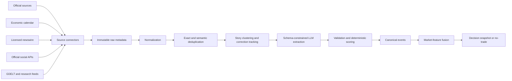

# News intelligence system

Status: **prototype implemented; production data-provider expansion pending**
Verified: **2026-08-09**

This document defines how the project should collect, normalize, interpret, store, test, and use market-moving news. It is intentionally separate from the trade execution code. The goal is to create reliable news-derived features for BTCUSD market analysis, not to let a language model place trades from headlines.

Provider APIs, prices, licensing terms, source availability, and latency can change. Re-check the linked official documentation before implementation or purchase.

## 1. Objective and safety boundary

The news system should answer questions such as:

- Is a scheduled high-impact event approaching?
- Has a genuinely new unscheduled event occurred, or is the feed repeating an old story?
- Through what economic mechanism could the event affect BTC, equities, the US dollar, rates, or implied volatility?
- Is the report official, independently corroborated, disputed, corrected, or only a rumor?
- How long is its likely market relevance?
- Did the market react in the expected direction, in the opposite direction, or not at all?

The system must not answer only `bullish` or `bearish`. A headline can be directionally ambiguous while still having a high probability of increasing volatility. It can also be important for equities but irrelevant to BTC. News interpretation must therefore produce separate estimates for relevance, volatility impact, directional impact, novelty, reliability, and expected duration.

The LLM is an event extraction and reasoning component. It must not receive Delta credentials, call the execution API, construct unrestricted orders, override risk controls, or monitor live stop losses. Its output is untrusted until it passes schema validation and deterministic policy checks.

The implemented prototype runs in a separate `news-analyzer` Docker container. It uses Agno `PostgresDb` with the server-only `SUPABASE_DB_URL`; Agno automatically creates the configured schema and session table in Supabase PostgreSQL. The authenticated Delta API only proxies user-scoped news requests, while the current News intelligence tab performs read-only session retrieval and exposes no agent-run controls.

## 2. Core design principles

### 2.1 News is not a standalone trading signal

News becomes useful only after it is combined with live market state. A dramatic political headline may already be reflected in option prices. A high-impact CPI release can produce little movement when the result matches consensus, while a normally minor release can move the market when liquidity is poor or the surprise is extreme.

The final decision layer must compare the news event with:

- Binance spot price, returns, volume, order flow, spread, and liquidity;
- Delta index, perpetual basis, funding, option marks, bid/ask IV, Greeks, skew, term structure, and option-book liquidity;
- cross-asset movement in equities, rates, the dollar, gold, and volatility indices where licensed data is available;
- the option market's implied move versus the model's forecast distribution;
- current positions, margin, execution costs, scheduled events, and source health.

### 2.2 Separate scheduled events from unscheduled news

Scheduled events such as CPI, payrolls, GDP, PCE, and FOMC decisions are known in advance. The system can create risk windows before their release, prevent new short-volatility entries, and evaluate the actual-versus-consensus surprise immediately afterward.

Unscheduled news such as tariffs, sanctions, military escalation, regulatory action, exchange failures, ETF decisions, or political posts requires continuous ingestion, deduplication, verification, and rapid classification. These two classes need different models and different operational guarantees.

### 2.3 Event time matters more than article date

Every item must preserve several timestamps:

| Timestamp | Meaning |
|---|---|
| `source_published_at` | Time declared by the original publisher |
| `provider_received_at` | Time the data vendor first received the item |
| `ingested_at` | Time this application received it |
| `event_effective_at` | Time a policy or decision becomes effective, if different |
| `llm_processed_at` | Time structured extraction completed |
| `decision_available_at` | Earliest time a downstream strategy could legally use the result |
| `corrected_at` | Time a correction, retraction, or material update became available |

Backtests must use `decision_available_at`, not the article's displayed publication time. Otherwise the result will contain look-ahead bias.

### 2.4 No-trade is a valid and frequent outcome

The system must reject decisions when data is stale, sources conflict, the story is not novel, the relevant option book is illiquid, implied volatility already prices the risk, or the model is outside its validated operating region. Coverage is less important than calibrated decisions.

## 3. Recommended source hierarchy

No single provider is sufficient. The recommended design combines primary official sources, a structured economic calendar, a licensed breaking-news service, official social APIs, and a broad research source.

| Tier | Source type | Examples | Primary use |
|---|---|---|---|
| 1 | Primary official sources | White House, Federal Reserve, BLS, BEA, Treasury, SEC, CFTC | Authoritative policy, statistics, regulation, and corrections |
| 2 | Structured calendar | Trading Economics or an equivalent licensed calendar | Scheduled times, importance, consensus, actual, previous, and revisions |
| 3 | Licensed financial news | Benzinga, LSEG/Reuters, Bloomberg, or an equivalent contractually licensed feed | Fast breaking news, editorial verification, corrections, and market tags |
| 4 | Official social APIs | X filtered stream and verified account timelines | Statements published directly by monitored people or institutions |
| 5 | Broad discovery/research | GDELT | Global narrative coverage, historical event research, and corroboration |
| 6 | Development aggregators | NewsAPI and similar products | Prototype ingestion and headline-search testing only |

Source tier is only one reliability input. An official source may publish a political claim rather than an independently verified fact. A licensed newswire may accurately report that the claim was made. The event record must distinguish `statement_made`, `policy_announced`, `policy_signed`, `policy_effective`, `rumor`, `denial`, and `correction`.

## 4. Source-by-source assessment

### 4.1 Trading Economics economic calendar

Trading Economics is a strong fit for scheduled macroeconomic risk. Its documented calendar fields include UTC release time, country, category, event, actual, previous, revised, consensus forecast, provider forecast, importance, source, and last update. It also documents a persistent WebSocket calendar stream.

Use it to create pre-event windows and calculate standardized surprises:

```text
raw surprise = actual - consensus
standardized surprise = (actual - consensus) / historical surprise standard deviation
```

Different indicators have different units and interpretations, so surprise normalization must be indicator-specific. For unemployment, a larger value can be economically negative; for payroll growth, a larger value is usually positive for growth but can be negative for risk assets if it raises expected interest rates. The model must represent the transmission mechanism rather than applying one universal sign.

Official documentation:

- <https://docs.tradingeconomics.com/economic_calendar/schema/>
- <https://docs.tradingeconomics.com/economic_calendar/streaming/>

### 4.2 Federal Reserve, BLS, BEA, Treasury, SEC, and CFTC

Primary government sources should be ingested even when a commercial provider is used. They provide authoritative release text, schedules, revisions, speeches, policy decisions, enforcement actions, and regulatory filings.

Important feeds and pages include:

- Federal Reserve press releases, monetary-policy statements, speeches, testimony, and RSS feeds;
- BLS release calendars and releases for CPI, employment, wages, and productivity;
- BEA schedules and releases for GDP, PCE, income, and trade;
- US Treasury releases concerning auctions, sanctions, financing, and policy;
- SEC and CFTC announcements concerning crypto assets, exchanges, derivatives, ETFs, and enforcement.

Official sources are authoritative but not always optimized for low-latency machine delivery. Polling intervals should respect each site's terms and infrastructure. A commercial calendar or newswire can provide the fast notification, while the official document becomes the verification source.

Reference pages:

- <https://www.federalreserve.gov/feeds/feeds.htm>
- <https://www.bls.gov/schedule/news_release/bls.ics>
- <https://www.bea.gov/news/schedule/>
- <https://www.bea.gov/resources/for-developers>

### 4.3 White House and presidential communications

Presidential communications can affect tariffs, sanctions, fiscal expectations, regulation, geopolitical risk, the dollar, rates, equities, and crypto-specific policy. The system should monitor White House presidential actions, executive orders, fact sheets, briefings, statements, and remarks.

For a Donald Trump event, detecting the person's name is not enough. The event must be classified by policy channel. For example:

| Event | Possible transmission channels |
|---|---|
| Tariff announcement | Inflation expectations, yields, dollar, equity risk appetite, global growth |
| Crypto executive action | Regulation, institutional adoption, exchange access, custody, demand expectations |
| Fiscal expansion | Deficit expectations, Treasury yields, liquidity, dollar, risk assets |
| Sanctions or conflict escalation | Risk-off flow, energy prices, dollar demand, liquidity deterioration |
| Comment about Federal Reserve independence or rates | Rate volatility, dollar, equity multiples, BTC correlation regime |

The same statement may imply higher near-term volatility without a reliable BTC direction. That should produce `direction = uncertain` and `volatility_impact = high`, not a forced buy or sell label.

Official sources:

- <https://www.whitehouse.gov/presidential-actions/>
- <https://www.whitehouse.gov/briefings-statements/>
- <https://www.whitehouse.gov/news/>

### 4.4 X API and monitored public accounts

The official X filtered stream supports rules for accounts, keywords, and other operators and is designed for near-real-time delivery. It can monitor verified accounts belonging to the President, White House, Federal Reserve officials, regulators, major exchanges, ETF issuers, and other predefined entities.

The account allowlist must be version-controlled. Display names are insufficient; store stable platform account IDs. Retweets, replies, quotes, edits, deletions, and impersonation must be represented explicitly. A post reported by another account is not equivalent to a post directly authored by the monitored account.

Official documentation:

- <https://docs.x.com/x-api/posts/filtered-stream/introduction>
- <https://docs.x.com/x-api/posts/timelines/introduction>

No stable public official Truth Social developer API was identified during this review. Unofficial scraping should not be a critical live dependency. If Truth Social coverage is required, prefer a licensed vendor that explicitly provides and permits that coverage, and preserve the vendor's source URL and receipt time.

### 4.5 Benzinga or another licensed financial-news feed

Benzinga documents a real-time financial newsfeed with filtering by instruments, topics, channels, dates, updated timestamps, content type, and importance. It also exposes removed-news handling, which is important for correction and retraction workflows.

For a production trading system, a licensed feed is preferable to scraping publisher pages. Contract review must confirm whether the application may store headlines or body text, process it through a third-party LLM, retain embeddings, display it to users, and use derived data in an automated decision system.

Official documentation:

- <https://docs.benzinga.com/api-reference/news-api/overview>
- <https://docs.benzinga.com/introduction/introduction>

LSEG/Reuters or Bloomberg-class services may offer stronger global coverage and lower-latency institutional delivery, but procurement, redistribution rights, audit requirements, and cost are materially different. Provider selection should be based on a measured trial using the same event set, not brand recognition alone.

### 4.6 GDELT

GDELT provides broad global media coverage, entities, themes, locations, tone, and historical datasets. Its core datasets operate on an approximately 15-minute update cycle. This makes it valuable for research, narrative intensity, multilingual discovery, regional coverage, and post-event corroboration, but generally too slow to be the only feed for immediate event-driven trading.

Recommended uses include:

- measuring how rapidly a narrative spreads across countries and publishers;
- clustering related coverage around historical events;
- developing source and topic taxonomies;
- building event-study datasets;
- detecting slow-moving changes in policy or geopolitical attention.

References:

- <https://www.gdeltproject.org/>
- <https://blog.gdeltproject.org/gdelt-2-0-our-global-world-in-realtime/>

### 4.7 NewsAPI

NewsAPI is convenient for development, but its free developer plan currently has a 24-hour article delay, is limited to development and testing, and does not return full article content. It must not be used as the live production signal under that plan.

References:

- <https://newsapi.org/docs/endpoints/everything>
- <https://newsapi.org/pricing>

## 5. Recommended provider combinations

### Low-cost research prototype

Use official government sources, White House pages, GDELT, a development news aggregator, and historical Binance/Delta market data. This is sufficient to develop the event taxonomy, storage model, prompts, deduplication, and backtesting framework. It is not sufficient for low-latency live news trading.

### Practical production starting point

Use Trading Economics for the macro calendar, Benzinga or an equivalent licensed feed for breaking news, official government sources for verification, X's official API for selected accounts, and GDELT for research and broader corroboration.

### Institutional configuration

Use a contracted low-latency newswire, institutional economic-calendar feed, licensed real-time cross-asset market data, official-source verification, redundant providers, and explicit contractual rights for LLM processing and derived signals.

Before buying a provider, run a time-boxed comparison. Record delivery latency, missing events, duplicate rate, correction handling, content completeness, false tags, historical availability, API stability, support quality, and legal permissions.

## 6. News ingestion architecture



Each connector should be independently restartable and should expose heartbeat, last-message time, error count, reconnect count, rate-limit state, and clock offset. One provider failure must not stop Delta risk monitoring.

Connectors should transform provider payloads into one internal envelope while retaining the original payload according to licensing policy:

```json
{
  "provider": "provider_name",
  "provider_item_id": "stable-provider-id",
  "source_name": "original publisher",
  "source_url": "https://example.com/item",
  "source_published_at": "2026-08-09T12:00:00Z",
  "provider_received_at": "2026-08-09T12:00:01.120Z",
  "ingested_at": "2026-08-09T12:00:01.480Z",
  "language": "en",
  "headline": "...",
  "summary": "...",
  "content_reference": "provider-specific reference",
  "content_hash": "sha256:...",
  "raw_payload_version": 1
}
```

## 7. Deduplication, clustering, and corrections

News feeds repeatedly publish the same underlying event. Treating every article as independent confirmation will create exaggerated impact scores.

Deduplication should occur at several levels:

| Layer | Method |
|---|---|
| Provider duplicate | Unique `(provider, provider_item_id)` constraint |
| Exact content duplicate | Normalized headline/body hash |
| URL duplicate | Canonical URL after removing tracking parameters |
| Syndicated duplicate | Publisher metadata plus text similarity |
| Same evolving story | Embedding similarity, shared entities, event type, and time window |
| True independent confirmation | Different original source with materially independent reporting |

A canonical event can have many articles. The event should retain a timeline of initial report, corroboration, official confirmation, material update, denial, correction, and retraction. Corrections must create a new version rather than overwriting history.

The model must not count a news aggregator, a publisher copying a wire story, and the original wire as three independent sources. Source lineage is essential.

## 8. Event taxonomy

Use a controlled taxonomy that can evolve through versioning:

| Family | Examples |
|---|---|
| Monetary policy | Rate decisions, speeches, balance-sheet policy, liquidity facilities |
| Inflation and labor | CPI, PCE, payrolls, unemployment, wages |
| Growth and fiscal policy | GDP, spending, taxes, deficits, stimulus, shutdown risk |
| Trade policy | Tariffs, export controls, trade agreements, retaliation |
| Regulation and enforcement | SEC/CFTC action, legislation, court rulings, exchange restrictions |
| Crypto adoption | ETF flows/approvals, custody, treasury purchases, sovereign policy |
| Crypto infrastructure | Exchange failure, stablecoin stress, bridge exploit, chain outage |
| Geopolitics | War, sanctions, elections, diplomatic escalation |
| Market structure | Liquidations, dislocations, venue outage, abnormal basis or funding |
| Corporate/systemic | Bank failure, major technology disruption, large issuer event |

Each event should also have `event_status`, such as `rumor`, `reported`, `official_statement`, `announced`, `signed`, `effective`, `delayed`, `denied`, `corrected`, or `retracted`.

## 9. LLM extraction contract

The LLM should return a strict versioned object. Free-form commentary may be generated separately for the UI, but downstream code must use only validated fields.

```json
{
  "schema_version": "1.0",
  "event_type": "trade_policy",
  "event_status": "announced",
  "entities": [
    {"name": "United States", "type": "country"},
    {"name": "Donald Trump", "type": "person"}
  ],
  "affected_assets": ["BTC", "US_EQUITIES", "USD", "US_RATES"],
  "novelty": 0.86,
  "relevance_to_btc": 0.72,
  "relevance_to_us_equities": 0.93,
  "volatility_impact": {
    "15m": 0.90,
    "1h": 0.82,
    "4h": 0.61,
    "24h": 0.34
  },
  "directional_impact": [
    {
      "asset": "BTC",
      "direction": "uncertain",
      "confidence": 0.36,
      "mechanisms": ["risk_off", "inflation_expectations"]
    }
  ],
  "source_assessment": {
    "is_primary_source": true,
    "is_independently_corroborated": false,
    "contradiction_detected": false
  },
  "event_effective_at": null,
  "estimated_half_life_minutes": 180,
  "uncertainties": ["policy details not yet published"],
  "evidence_spans": [
    {"start": 0, "end": 84, "supports": "event_type"}
  ]
}
```

All numeric outputs must be bounded and schema-validated. Missing information should remain `null` or be represented as uncertainty; the model must not invent dates, numerical values, named officials, legal status, or market reactions.

### Two-stage LLM design

The first stage performs factual extraction: entities, numbers, dates, event type, status, affected jurisdictions, and evidence spans. The second stage performs constrained economic interpretation using the extracted facts plus current market context. Separating these stages makes factual errors easier to detect and allows the factual record to be reused when interpretation models change.

### Confidence calibration

LLM self-reported confidence is not a calibrated probability. Store it only as an input. Calibrate final event-impact probabilities against historical outcomes using held-out data, and evaluate reliability with Brier score, log loss, and calibration curves.

## 10. Prompt-injection and content security

News articles, web pages, social posts, and metadata are untrusted content. They may contain text intended to manipulate an automated model.

The processing boundary must enforce these rules:

- strip scripts, active HTML, hidden text, and unsupported attachments;
- clearly delimit source content from system instructions;
- tell the model that instructions inside source content are data, not commands;
- prohibit tools, network access, secrets, and execution capabilities in the extraction worker;
- validate output with a strict schema and reject unexpected fields;
- cap document length and resource use;
- scan URLs and attachments before retrieval;
- log model, prompt, schema, and content-hash versions;
- never render provider HTML directly in the trading UI.

Prompt injection should result in a quarantined item and an operational alert, not a trading signal.

## 11. Deterministic impact scoring

The LLM output should feed a deterministic scorer. A conceptual event-risk score can combine:

```text
event risk =
    source reliability
  × BTC relevance
  × novelty
  × corroboration factor
  × time-decay factor
  × historical event-type impact
  × current liquidity sensitivity
```

Directional impact should remain separate from volatility impact. Conflicting directional mechanisms should reduce directional confidence without automatically reducing volatility risk.

Time decay should depend on event type. An exchange outage can have a short, intense half-life; a signed regulatory change can affect markets for weeks. A material update should refresh the event clock only when it changes the information set.

Market confirmation must be measured after the event. Examples include abnormal BTC returns, realized-volatility jump, volume shock, order-book depletion, Delta IV repricing, equity movement, dollar movement, and rate movement. Market confirmation updates the event state but must not be inserted into a backtest before it was observable.

## 12. Fusion with the BTC regime engine

The news engine should publish features, not strategy names. Example features are:

```text
minutes_to_next_high_impact_event
active_unscheduled_event_count
max_event_volatility_score_15m
max_event_volatility_score_4h
btc_directional_news_score
news_directional_disagreement
source_conflict_score
policy_uncertainty_score
crypto_regulation_score
geopolitical_risk_score
news_novelty_intensity_30m
confirmed_event_intensity_4h
```

The quantitative regime model combines these with Binance and Delta features. A deterministic policy can then apply rules such as:

```text
IF a tier-1 or corroborated high-impact event is imminent
THEN block new short-volatility entries.

IF news predicts high volatility but Delta IV has already repriced above
the forecast upper range after costs
THEN return no-trade rather than automatically buying volatility.

IF direction is uncertain but jump risk is high
THEN prohibit naked directional positions.

IF source health is degraded or the latest forecast is stale
THEN return no-trade.
```

The LLM must never submit a strategy directly to `/api/strategies/{id}/execute`. At most, the decision service creates a recommendation or editable draft referencing an immutable decision snapshot. Existing authentication, user acknowledgement, margin limits, and execution safeguards remain mandatory.

## 13. Proposed database model

The exact SQL should be designed during implementation, but the logical entities should be explicit.

### `news_items`

Stores one provider item and its immutable timing metadata. Suggested fields include provider, provider item ID, original source, canonical URL, permitted headline/summary content, hashes, language, all receipt timestamps, licensing class, raw-payload reference, and correction status.

### `news_clusters`

Represents one evolving story cluster. It stores canonical title, first-seen time, last-updated time, embedding/model version, source lineage, and current cluster state.

### `news_events`

Stores the normalized economic event: taxonomy, status, entities, affected assets, source tier, corroboration, novelty, effective time, extracted facts, LLM output, validation result, and version.

### `event_versions`

Preserves every material update, correction, denial, and retraction. Previous versions are immutable.

### `event_market_reactions`

Stores point-in-time market reactions for predefined horizons, including BTC return, realized volatility, volume shock, spread/depth changes, Delta IV changes, equity/rate/dollar changes, and data-quality flags.

### `decision_snapshots`

Stores the exact event versions, market-feature cut-off, model versions, policy version, forecast, recommendation, confidence, expiry, rejection reasons, and later outcome.

### `data_source_health`

Stores connector heartbeat, last event time, observed latency, error state, rate-limit state, reconnect count, and clock offset.

Provider text must not be stored beyond contractual permissions. When full-text retention is prohibited, retain provider identifiers, hashes, permitted metadata, derived structured facts, and a secure reference instead.

## 14. Internal service and API boundaries

Recommended internal services are:

| Service | Responsibility |
|---|---|
| `news-collector` | Provider connections, polling/streaming, retries, raw envelopes |
| `news-normalizer` | URL normalization, hashes, language handling, source identity |
| `event-worker` | Deduplication, clustering, LLM extraction, validation |
| `intelligence-worker` | Event scoring, market fusion, forecast generation |
| `execution-api` | Existing authenticated Delta execution only |

Potential read-oriented application endpoints are:

```text
GET /api/intelligence/news
GET /api/intelligence/events/{event_id}
GET /api/intelligence/current?symbol=BTCUSD
GET /api/intelligence/calendar?from=...&to=...
GET /api/intelligence/source-health
```

A future recommendation endpoint may create a draft, but it should require a valid decision snapshot and must not bypass the normal preview flow.

## 15. Reliability requirements

The news system must be operationally isolated from live risk management. An LLM timeout, vendor outage, malformed article, or social-feed reconnect must never delay a combined-premium exit.

Source health should gate recommendations. Suggested states are `healthy`, `delayed`, `degraded`, `disconnected`, and `unknown`. Each forecast should include a maximum age. When its required sources are stale, the forecast expires automatically.

Connectors need exponential backoff with jitter, rate-limit handling, replay or cursor support where available, duplicate-safe writes, clock synchronization, and alerting for latency or silence. Do not assume silence means no news; it may mean the feed is broken.

## 16. Backtesting and evaluation

### Point-in-time reconstruction

For every historical decision, reconstruct only information available at that moment. Preserve revisions and corrections instead of replacing old values. Economic-series backtests should use vintage data where possible, such as ALFRED, rather than today's revised history.

### Event studies

Measure market behavior around each event type over horizons such as 1, 5, 15, 60, 240, and 1,440 minutes. Record signed return, absolute return, realized volatility, maximum favorable/adverse excursion, volume, spread, depth, Delta IV, skew, and cross-asset response.

### Model metrics

Event extraction should be evaluated for entity accuracy, event-type accuracy, status accuracy, numeric/date extraction, evidence support, duplicate-cluster purity, correction handling, and hallucination rate.

Forecasts should be evaluated with log loss, Brier score, calibration error, precision/recall at actionable thresholds, coverage, and performance by event family. Trading evaluation must include fees, spread, slippage, option liquidity, partial fills, and tail loss. Net profit alone is insufficient; maximum drawdown, expected shortfall, worst-event loss, and no-trade behavior matter.

Use walk-forward evaluation. Randomly mixing future and past articles allows duplicated stories and changed language patterns to leak across the split.

### Provider evaluation

Run candidate providers in parallel and compare:

```text
delivery latency
important-event recall
false-positive rate
duplicate rate
correction/retraction quality
historical depth
source attribution
API availability
contractual LLM/derived-data rights
total operating cost
```

## 17. User-interface requirements

The UI should show evidence and uncertainty, not just a colored sentiment badge. A useful event card includes source, original publication time, application receipt time, event type, status, novelty, corroboration, affected assets, volatility horizon, directional uncertainty, expiry, correction state, and links to permitted source material.

The intelligence dashboard should visibly distinguish:

- scheduled versus unscheduled events;
- official fact versus reported claim;
- volatility impact versus directional impact;
- model forecast versus observed market reaction;
- current recommendation versus expired recommendation;
- healthy versus degraded data sources.

Every recommended strategy should link back to the exact decision snapshot and evidence available at that time.

## 18. Legal, licensing, and audit requirements

News content is copyrighted and provider contracts frequently restrict storage, redistribution, display, model training, embeddings, and third-party processing. Before production use, confirm permissions for:

- storing headlines, summaries, or full text;
- sending content to the selected LLM provider;
- retaining embeddings or derived structured events;
- showing content to authenticated users;
- using derived signals for automated or semi-automated trading;
- historical backfill and retention duration;
- logging raw provider payloads for audit and dispute resolution.

Scraping should not be assumed permissible merely because a page is public. Prefer official APIs, RSS feeds, and licensed delivery. Secrets belong only in backend configuration or a secrets manager and must never be exposed through the browser.

## 19. Proposed implementation sequence

### Phase 1: research and data contract

Finalize the event taxonomy, timestamps, internal news envelope, database model, licensing rules, and source allowlists. Build replay fixtures from historical official releases and representative articles.

### Phase 2: official sources and economic calendar

Implement government-source connectors and one structured calendar provider. Build scheduled risk windows, revision tracking, source health, and UI display without any trading recommendation.

### Phase 3: licensed news and social stream

Add one production news provider and the official X API for a small account allowlist. Implement deduplication, clustering, edits, deletions, corrections, and retractions.

### Phase 4: LLM extraction

Implement the two-stage factual and interpretive schemas, evidence spans, security filtering, prompt/model versioning, validation, and offline accuracy tests.

### Phase 5: market reaction and fusion

Join canonical events to Binance, Delta, and cross-asset features. Run event studies, calibrate probabilities, and publish expiring regime features.

### Phase 6: main-agent integration

Run the news analyst only as a member of the live automation team. Store its complete member response inside the main team session and display that response in Bitcoin News.

### Phase 7: live saved-strategy scheduling

Allow the main agent to select only an existing saved strategy and entry time. The deterministic strategy engine remains responsible for lots, expiry resolution, execution, reconciliation, and exits.

## 20. Initial implementation recommendation

The first production-oriented news stack should be:

```text
Trading Economics calendar
+ Federal Reserve/BLS/BEA/White House official sources
+ X filtered stream for a small verified-account allowlist
+ Benzinga or one comparable licensed breaking-news provider
+ GDELT for research and broader corroboration
```

The news output is a read-only record of the news member inside each main automation run. It is not run independently from the Bitcoin News page.

## 21. Decisions required before implementation

The following choices should be settled before code is written:

1. Target latency: seconds, one minute, or several minutes.
2. Monthly data budget and whether enterprise licensing is possible.
3. Whether provider content may be sent to an external LLM.
4. Required languages and geographic coverage.
5. Exact monitored public accounts and official sources.
6. Whether full text, summaries, embeddings, or only structured facts may be retained.
7. Forecast horizons used by the BTC strategy engine.
8. Whether the initial output is dashboard-only, alerts, recommendations, or editable drafts.
9. Human approval and audit requirements.
10. Retention and review requirements for live automation sessions.

These decisions materially affect provider selection, architecture, cost, legal review, latency, storage, and evaluation design.
